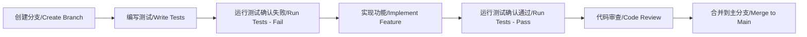

# 大富翁游戏敏捷开发文档 / Monopoly Game Agile Development Documentation

## 项目概述 / Project Overview

本项目旨在开发一个基于终端命令行的大富翁游戏，采用敏捷开发方法论，实现测试驱动开发(TDD)和持续集成(CI/CD)。

This project aims to develop a terminal command-line based Monopoly game using agile development methodology, implementing Test-Driven Development (TDD) and Continuous Integration/Continuous Deployment (CI/CD).

## 项目架构 / Project Architecture

```
rich/
├── src/                    # 源代码模块 / Source code modules
│   ├── __init__.py
│   └── game/              # 游戏逻辑模块 / Game logic modules
│       ├── __init__.py
│       └── dice.py        # 骰子功能 / Dice functionality
├── tests/                 # 测试模块 / Test modules
│   ├── __init__.py
│   └── test_dice.py       # 骰子测试 / Dice tests
├── docs/                  # 文档 / Documentation
├── .github/workflows/     # CI/CD 流水线 / CI/CD pipelines
├── requirements.txt       # 依赖管理 / Dependency management
└── pyproject.toml         # 项目配置 / Project configuration
```

## 敏捷开发原则 / Agile Development Principles

### 1. 测试驱动开发 (TDD) / Test-Driven Development

我们采用红-绿-重构循环：
We follow the Red-Green-Refactor cycle:

1. **红色阶段 (Red)**: 先写失败的测试
   - Write failing tests first
2. **绿色阶段 (Green)**: 写最少的代码使测试通过
   - Write minimal code to make tests pass
3. **重构阶段 (Refactor)**: 优化代码质量
   - Refactor code for better quality

### 2. 持续集成 (CI/CD) / Continuous Integration

每次代码提交都会触发自动化流水线：
Every code commit triggers automated pipelines:

- 自动化测试 / Automated testing
- 代码质量检查 / Code quality checks
- 安全扫描 / Security scanning
- 测试覆盖率报告 / Test coverage reporting

## 迭代计划 / Sprint Planning

### Sprint 1: 基础架构 (已完成) / Infrastructure (Completed)
- [x] 项目结构搭建 / Project structure setup
- [x] 测试框架配置 / Test framework configuration
- [x] CI/CD 流水线设置 / CI/CD pipeline setup
- [x] 骰子功能开发和测试 / Dice functionality development and testing

### Sprint 2: 游戏板块 (计划中) / Game Board (Planned)
- [ ] 游戏板块类设计 / Game board class design
- [ ] 位置和属性管理 / Position and property management
- [ ] 板块测试套件 / Board test suite

### Sprint 3: 玩家系统 (计划中) / Player System (Planned)
- [ ] 玩家类实现 / Player class implementation
- [ ] 资金和属性管理 / Money and property management
- [ ] 玩家交互测试 / Player interaction tests

### Sprint 4: 游戏逻辑 (计划中) / Game Logic (Planned)
- [ ] 回合制系统 / Turn-based system
- [ ] 购买和交易逻辑 / Buy and trade logic
- [ ] 游戏状态管理 / Game state management

### Sprint 5: 用户界面 (计划中) / User Interface (Planned)
- [ ] 命令行界面设计 / CLI design
- [ ] 游戏显示优化 / Game display optimization
- [ ] 用户体验测试 / User experience testing

## 开发工作流 / Development Workflow

### 1. 功能开发流程 / Feature Development Process



### 2. 分支策略 / Branching Strategy

- `main/master`: 生产就绪代码 / Production-ready code
- `develop`: 开发分支 / Development branch
- `feature/*`: 功能分支 / Feature branches
- `hotfix/*`: 热修复分支 / Hotfix branches

### 3. 代码审查检查清单 / Code Review Checklist

- [ ] 测试覆盖率 > 90% / Test coverage > 90%
- [ ] 所有测试通过 / All tests pass
- [ ] 代码风格一致 / Consistent code style
- [ ] 文档更新 / Documentation updated
- [ ] 性能影响评估 / Performance impact assessed

## 质量保证 / Quality Assurance

### 1. 自动化测试策略 / Automated Testing Strategy

```python
# 测试金字塔 / Test Pyramid
单元测试 (Unit Tests)     - 70%  # 快速、隔离的功能测试
集成测试 (Integration)    - 20%  # 模块间交互测试
端到端测试 (E2E)         - 10%  # 完整用户流程测试
```

### 2. 代码质量指标 / Code Quality Metrics

- 测试覆盖率目标: 95% / Test coverage target: 95%
- 圈复杂度限制: 10 / Cyclomatic complexity limit: 10
- 代码重复率: < 5% / Code duplication: < 5%

### 3. 持续监控 / Continuous Monitoring

- 构建状态监控 / Build status monitoring
- 测试结果趋势 / Test result trends
- 代码质量变化 / Code quality changes
- 性能基准测试 / Performance benchmarking

## 团队协作 / Team Collaboration

### 1. 日常站会 (Daily Standup) / Daily Standup

每日讨论内容 / Daily discussion topics:
- 昨天完成的工作 / Yesterday's work completed
- 今天计划的工作 / Today's planned work
- 遇到的障碍 / Encountered obstacles

### 2. 回顾会议 (Retrospective) / Retrospective

每个 Sprint 结束后评估：
Evaluate at the end of each Sprint:
- 做得好的地方 / What went well
- 需要改进的地方 / Areas for improvement
- 下个 Sprint 的改进措施 / Improvement actions for next Sprint

## 工具和技术栈 / Tools and Technology Stack

### 开发工具 / Development Tools
- **语言**: Python 3.8+ / **Language**: Python 3.8+
- **测试框架**: pytest / **Testing Framework**: pytest
- **代码覆盖率**: pytest-cov / **Code Coverage**: pytest-cov
- **代码格式化**: black, isort / **Code Formatting**: black, isort
- **静态分析**: flake8, mypy / **Static Analysis**: flake8, mypy
- **安全扫描**: bandit, safety / **Security Scanning**: bandit, safety

### CI/CD 工具 / CI/CD Tools
- **版本控制**: Git / **Version Control**: Git
- **CI/CD 平台**: GitHub Actions / **CI/CD Platform**: GitHub Actions
- **代码覆盖率报告**: Codecov / **Coverage Reporting**: Codecov

## 部署策略 / Deployment Strategy

### 1. 环境管理 / Environment Management
- **开发环境** (Development): 本地开发 / Local development
- **测试环境** (Testing): 自动化测试 / Automated testing
- **生产环境** (Production): 发布版本 / Release version

### 2. 发布流程 / Release Process
1. 代码冻结 / Code freeze
2. 最终测试 / Final testing
3. 版本标记 / Version tagging
4. 发布部署 / Release deployment
5. 监控验证 / Monitoring verification

## 风险管理 / Risk Management

### 技术风险 / Technical Risks
- **依赖项过时**: 定期更新依赖 / **Outdated dependencies**: Regular updates
- **性能问题**: 性能基准测试 / **Performance issues**: Performance benchmarking
- **安全漏洞**: 安全扫描和审计 / **Security vulnerabilities**: Security scanning and audits

### 项目风险 / Project Risks
- **需求变更**: 敏捷响应机制 / **Requirement changes**: Agile response mechanism
- **团队协作**: 定期沟通和反馈 / **Team collaboration**: Regular communication and feedback
- **质量控制**: 自动化质量门控 / **Quality control**: Automated quality gates

## 文档维护 / Documentation Maintenance

本文档将随着项目进展持续更新，确保反映最新的开发实践和项目状态。

This document will be continuously updated as the project progresses to ensure it reflects the latest development practices and project status.

---

**最后更新 / Last Updated**: 2024年12月
**版本 / Version**: v1.0
**维护者 / Maintainer**: 开发团队 / Development Team