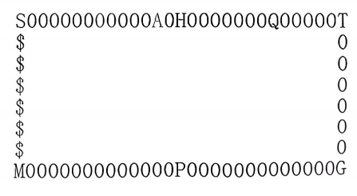

**软件工程-2025.9.20**

**散装用户故事**

**1. 游戏初始化与设置**

**用户故事 1.1：设置游戏参数**

**作为** 玩家，

**为了** 控制游戏的整体时长和难度，

**希望** 在启动游戏时设置所有玩家的初始资金。

**验收标准：**

游戏启动后，首先提示"请输入初始资金（1000-50000），默认10000："。

如果用户直接回车，则使用默认值10000。

如果输入的值不在1000-50000范围内，**提示错误**并请用户重新输入，直到输入有效值。

设置的资金值将用于所有玩家。

**用户故事 1.2：选择游戏角色**

**作为** 玩家，

**为了**和我朋友一起进行游戏，

**希望** 从四个可选角色中**选择2-4**个来开始游戏。

**验收标准：**

系统提示："请选择2\~4位不重复玩家，输入编号即可（1、钱夫人（Q）；2、阿土伯（A）；3、孙小美（S）；4、金贝贝（J））"。

输入应为数字，数字之间**不能有空格或分隔符**（如"13"、"134"）**。**

如果输入重复编号、非数字字符或数量不在2-4个，提示错误并重新输入。

选择成功后，控制台显示的玩家命令提示符应为其姓名和颜色（钱夫人-红Q、阿土伯-绿A、孙小美-蓝S、金贝贝-黄J）。

**2. 移动与地图交互**

{width="4.65625in" height="2.5520833333333335in"}

**用户故事 2.1：掷骰子移动**

**作为** 当前玩家，

**为了** 在地图上触发各种事件，

**希望**通过输入roll命令来掷骰子并随机移动1-6步。

**验收标准：**

输入roll（不区分大小写）后，系统生成一个1-6的随机数。

玩家棋子根据点数沿地图顺时针移动相应步数。

移动后，自动触发停留地点的事件（如空地、房产、道具屋等）。

事件处理完毕后，自动切换至下一玩家，切换顺序是**初始选择的顺序**。

**用户故事 2.2：购买空地**

**作为** 玩家，

**当我** 停留在一块未被购买的空地（显示为白色"0"）时，

**为了** 扩大我的资产规模，

**希望** 系统提供空地购买功能。

{width="5.75in" height="0.3333333333333333in"}

**验收标准：**

系统提示："此处为空地，价值XX元，是否购买？(Y/N)"

输入Y：若资金足够，则扣款，土地归属该玩家，地图符号变为代表该玩家的颜色（如钱夫人的红色"Q"）；若资金不足，则系统提示资金不足，购买失败。

输入N：则不购买，土地保持为空地。

购买成功后，该地块成为玩家的"空地"级别资产，数字变成**玩家特定的颜色**。

**用户故事 2.3：升级房产**

**作为** 玩家，

**当我** 停留在自己拥有的空地或低等级房产上时，

**为了** 提高该地产的过路费收入，

**希望** 系统提示我是否升级。

{width="5.75in" height="0.9791666666666666in"}

**验收标准：**

系统提示："是否升级该房产？升级费用为XX元 (Y/N)"

升级规则：空地(0) -\> 茅屋(1) -\> 洋房(2) -\>
摩天楼(3)。每次升级费用等同于购买空地时的价格。

输入Y且资金足够：升级成功，地图上该位置的符号变为相应的数字（1,2,3），**颜色保持不变**。

输入N或资金不足：升级失败。

**用户故事 2.4：支付过路费**

**作为** 玩家，

**当我** 停留在其他玩家拥有的房产上时，

**为了** 模拟真实的房产经济，

**希望** 系统自动从我资金中扣除相应的过路费并支付给地产所有者。

{width="5.75in" height="0.5416666666666666in"}

**验收标准：**

过路费 = 该地产当前等级的基购础价值 (房产等级+1) \*
0.5（例如，2级茅屋的基础价值为1000\*（房产等级2+1）=
3000元，则**过路费**为 1000 \* (2+1) \* 0.5 = 1500元）。

支付前系统提示："停留在\[玩家名\]的\[地产等级\]上，支付过路费XX元"。

若当前玩家资金足够，则正常支付。

若当前玩家资金不足，则触发破产流程。

**例外情况**：如果当前玩家有"财神"附身，提示"财神附身，免过路费！"，并无需支付。如果地产所有者正在医院或监狱，也无需支付。

**用户故事 2.5：住院状态**

**作为**玩家，

**当有人**触发炸弹时，

**为了** 游戏平衡性地惩罚危险行为

**希望** 被送入医院并暂停行动3轮。

**验收标准：**

触发炸弹后立即进入住院状态

系统显示：\"\[玩家名\]被炸伤，送进医院住院3天！\"

住院期间跳过该玩家的回合并显示住院倒计时：\"\[玩家名\]住院中，还剩X轮\"

住院期间免收过路费（作为地产主时）

住院结束后自动恢复正常状态

**用户故事2.6：遇到路障**

**作为**玩家

**当有人**前进过程中遇到路障时

**为了**游戏平衡性地惩罚危险行为

**希望**该玩家被阻挡前进，停留在路障所在处

**验收标准：**

前进过程中遇到路障，位置被阻挡在路障处

系统显示：\"\[玩家名\]遇到路障，被拦截前进！\"

**用户故事2.7：监狱状态**

**作为** 玩家，

**当玩家** 触发特定事件时，

**为了** 增加游戏的惩罚机制，

**希望** 玩家被关入监狱并暂停行动2轮，

**验收标准：**

触发监狱事件后立即进入监狱状态

系统显示：\"\[玩家名\]被关进监狱，服刑2天！\"

监狱期间跳过该玩家的回合，并显示服刑倒计时：\"\[玩家名\]服刑中，还剩X轮\"

监狱期间免收过路费（作为地产主时）

服刑结束后自动恢复正常状态

**3. 资产与道具管理**

**用户故事 3.1：查询资产**

**作为** 玩家，

**为了** 查看我当前的资金、点数、房产列表和等级以及道具列表，

**希望** 在任何我的回合内输入query命令。

**验收标准：**

输入query后，系统清晰列出：

玩家名、资金、点数。

拥有的所有地产（位置和等级）。

拥有的所有道具（种类和数量）。

如：

**用户故事 3.2：出售房产**

**作为** 玩家，

**为了** 快速回笼资金，应对危机，

**希望** 在我的回合内通过sell n命令出售我拥有的任意房产。

**验收标准：**

命令格式：sell \[地图位置索引\]（例如 sell 12）。

出售价格为该地产购买和升级所花费的总成本的2倍。

出售成功后，资金立即到账，该地产恢复为空地"0"，颜色**变回默认的白色**。

如果指定的位置不是当前玩家的地产，提示错误："非法的房产位置或您不拥有该房产"。

{width="5.75in" height="1.1354166666666667in"}

**用户故事 3.3：购买道具**

**作为** 玩家，

**当我** 停留在"道具屋"时，

**为了** 在游戏中使用策略

**希望** 看到一个道具列表并用点数购买它们并害人或利己。

**验收标准：**

进入道具屋后显示："欢迎光临道具屋，请选择您所需要的道具："

显示道具列表：

1\. 路障 - 50点 (#)

2\. 机器娃娃 - 30点

3\. 炸弹 - 50点 (@)

玩家输入编号选择购买。

如果点数足够，则扣点，道具存入玩家背包。

每位玩家最多拥有10个道具，超过则提示"道具已满，无法购买"。

如果点数不足以购买最便宜的道具，或输入f，则自动退出道具屋。

**用户故事 3.4：使用路障**

**作为** 玩家，

**为了** 拦截其他玩家，

**希望** 在我的回合内使用block n命令放置路障。

**验收标准：**

命令格式：block \[步数\]（例如 block 5 或 block
-3）。步数范围必须在\[-10, 10\]之间（0无效）。

路障（"#"）被放置在从当前位置向前（正数）或向后（负数）计算n步的地图格上。

任何玩家（包括自己）经过该格子时，立即被拦截并结束本轮移动。

路障在使用后或触发后消失。

在放置在有玩家在的地上提示：此处有人，禁止放置

**用户故事 3.5：使用炸弹**

**作为** 玩家，

**希望**在我的回合内使用bomb n命令放置炸弹，

**为了** 将对手炸伤送进医院。

**验收标准：**

命令格式：bomb \[步数\]（例如 bomb 5 或 bomb -3）。步数范围必须在\[-10,
10\]之间（0无效）。

炸弹（"@"）被放置在从当前位置向前（正数）或向后（负数）计算n步的地图格上。

任何玩家（包括自己）经过该格子时，立即被炸伤，送入医院，并住院3轮（跳过3次回合）。

炸弹在使用后或触发后消失。

在放置在有玩家在的地上提示：此处有人，禁止放置

**用户故事 3.6：使用机器娃娃**

**作为** 玩家，

**为了** 清除我前方道路上的道具，安全通过，

**希望**在我的回合内使用robot命令。

**验收标准：**

输入robot命令。

机器娃娃会清除当前玩家位置\*\*前方\*\*10步范围内的所有道具（路障和炸弹）。

清除后，这些道具从地图上消失。

机器娃娃在使用后消失。

**4. 特殊建筑事件**

**用户故事 4.1：获取礼品**

**作为** 玩家，

**当我** 停留在"礼品屋"时，

**为了**获得意外的好处，

**希望**从三件礼品中选择一件获得。

**验收标准：**

进入礼品屋后显示："欢迎光临礼品屋，请选择一件您喜欢的礼品："

显示礼品列表：

1\. 奖金 - 2000元

2\. 点数卡 - 200点

3\. 财神 - 5轮内免过路费

玩家输入编号选择。选择后礼品立即生效，并退出礼品屋。

如果输入错误，也视为放弃，退出礼品屋。

**用户故事 4.2：触发魔法事件**

**作为** 玩家，

**当我** 停留在"魔法屋"时，

**为了**为游戏增加更多变数和乐趣，

**希望**触发一个随机（或特定）的魔法事件。

**验收标准：**

进入魔法屋后，系统提示："欢迎光临魔法屋，魔法施展中\..."。

触发一个预设的魔法效果（例如：与所有玩家互换位置、强制所有玩家出售一块土地、未来3步点数翻倍等）。*（具体效果需后续定义）*

魔法效果执行后，玩家的回合结束。

**5. 游戏状态与结束**

**用户故事 5.1：玩家破产**

**作为** 系统，

**当** 一名玩家的资金变为负数时（例如支付过路费后），

**为了** 游戏能正常进行到最后，

**希望**让该玩家破产并退出游戏。

**验收标准：**

系统广播："\[玩家名\]破产了！！"

该玩家所有房产归还系统，重置为空地"0"。

该玩家从游戏列表中移除。

**用户故事 5.2：游戏胜利**

**作为** 最后一名未破产的玩家，

**当** 所有其他玩家都破产时，

**为了** 获得游戏成就感，

**希望** 系统宣布我为胜利者并结束游戏。

**验收标准：**

当只剩一名玩家时，游戏立即结束。

系统显示大幅面的祝贺信息："游戏结束！\[玩家名\]是最终的胜利者！"

程序退出或返回主菜单。

**6. 测试与辅助功能**

**用户故事 6.1：遥控骰子**

**作为** 测试人员，

**为了 高效地测试地图上特定位置的事件，**

**希望** 使用step n命令来精确控制玩家移动的步数。

**验收标准：**

命令格式：step \[步数\]（例如 step 10）。

玩家棋子精确移动指定的步数，而非随机数。

移动后正常触发所在地点的事件。

此命令仅用于测试，不影响正常游戏逻辑。

**用户故事 6.2：寻求帮助**

**作为** 新玩家，

**为了**查看所有可用的命令及其用法，而不需要记住所有规则，

**希望** 随时输入help命令。

**验收标准：**

输入help后，系统显示一个清晰的命令列表，包含命令名称、参数和简短说明（如同附录中的命令表）。

**用户故事 6.3：退出游戏**

**作为** 玩家，

**为了**可以立即结束当前游戏，

**希望** 在任何时候通过输入quit命令。

**验收标准：**

输入quit命令，游戏结束并退出。

**表格形式用户故事：**

+---+-----+-----------+---------------------------+-----+-----+-----+
| * | *   | **用户故  | **验收标准**              | *   | **s | *   |
| * | *用 | 事描述**  |                           | *优 | tor | *疑 |
| 模 | 户 |           |                           | 先  | y点 | 问  |
| 块 | 故 |           |                           | 级  | 数  | **  |
| * | 事  |           |                           | **  | （p |     |
| * | I   |           |                           |     | oin |     |
|   | D** |           |                           |     | t） |     |
|   |     |           |                           |     | **  |     |
+---+-----+-----------+---------------------------+-----+-----+-----+
| * | *   | 作为玩家  | 游戏启动后，首先          | M   | 2   |     |
| * | *1. | ，为了控  | 提示"请输入初始资金（100  |     |     |     |
| 1 | 1** | 制游戏的  | 0-50000），默认10000："。 |     |     |     |
| . |     | 整体时长  |                           |     |     |     |
| 游 | *  | 和难度，  | 如果用户直接              |     |     |     |
| 戏 | *设 | 希望在启 | 回车，则使用默认值10000。 |     |     |     |
| 初 | 置 | 动游戏时  |                           |     |     |     |
| 始 | 游 | 设置所有  | 如果                      |     |     |     |
| 化 | 戏 | 玩家的初  | 输入的值不在1000-50000范  |     |     |     |
| 与 | 参 | 始资金。  | 围内，提示错误并请用户重  |     |     |     |
| 设 | 数 |           | 新输入，直到输入有效值。  |     |     |     |
| 置 | ** |           |                           |     |     |     |
| * |     |           | 设置                      |     |     |     |
| * |     |           | 的资金值将用于所有玩家。  |     |     |     |
+---+-----+-----------+---------------------------+-----+-----+-----+
|   | *   | 作为      | 系统提示："请选择2        | M   | 2   |     |
|   | *1. | 玩家，为  | \~4位不重复玩家，输入编号 |     |     |     |
|   | 2** | 了和我朋  | 即可（1、钱夫人（Q）；2、 |     |     |     |
|   |     | 友一起进  | 阿土伯（A）；3、孙小美（  |     |     |     |
|   | *   | 行游戏，  | S）；4、金贝贝（J））"。  |     |     |     |
|   | *选 | 希望从四  |                           |     |     |     |
|   | 择  | 个可选角  | 输入应为数字，数字        |     |     |     |
|   | 游  | 色中选择  | 之间不能有空格或分隔符（  |     |     |     |
|   | 戏  | 2-4个来开 | 如"13"、"134"、"312"）。  |     |     |     |
|   | 角  | 始游戏。  |                           |     |     |     |
|   | 色  |           | 如果输入重复编号          |     |     |     |
|   | **  |           | 、非数字字符或数量不在2-  |     |     |     |
|   |     |           | 4个，提示错误并重新输入。 |     |     |     |
|   |     |           |                           |     |     |     |
|   |     |           | 选择成功后，控            |     |     |     |
|   |     |           | 制台显示的**玩家命令提示  |     |     |     |
|   |     |           | 符**应为其姓名和颜色（如  |     |     |     |
|   |     |           | ：钱夫人\>待输入命令）。  |     |     |     |
+---+-----+-----------+---------------------------+-----+-----+-----+
| * | *   | 作为      | 输入                      | M   | 4   |     |
| * | *2. | 当前玩家  | roll（不区分大小写）后，  |     |     |     |
| 2 | 1** | ，为了在  | 系统生成一个1-6的随机数。 |     |     |     |
| . |     | 地图上触  |                           |     |     |     |
| 移 | *  | 发各种事  | 玩家棋子根据点数沿        |     |     |     |
| 动 | *掷 | 件，希望 | 地图顺时针移动相应步数。  |     |     |     |
| 与 | 骰 | 通过输入  |                           |     |     |     |
| 地 | 子 | roll命令  | 移动后，自                |     |     |     |
| 图 | 移 | 来掷骰子  | 动触发停留地点的事件（如  |     |     |     |
| 交 | 动 | 并随机移  | 空地、房产、道具屋等）。  |     |     |     |
| 互 | ** | 动1-6步。 |                           |     |     |     |
| * |     |           | 事件处理完毕后            |     |     |     |
| * |     |           | ，自动切换至下一玩家，切  |     |     |     |
|   |     |           | 换顺序是初始选择的顺序。  |     |     |     |
+---+-----+-----------+---------------------------+-----+-----+-----+
|   | *   | 作        | 系统提示："此处为空地，价 | M   | 3   |     |
|   | *2. | 为玩家，  | 值XX元，是否购买？(Y/N)"  |     |     |     |
|   | 2** | 当我停留  |                           |     |     |     |
|   |     | 在一块未  | 输入Y：若资金足           |     |     |     |
|   | *   | 被购买的  | 够，则扣款，土地归属该玩  |     |     |     |
|   | *购 | 空地（显  | 家，地图符号变为代表该玩  |     |     |     |
|   | 买  | 示为白色  | 家的颜色（如钱夫人的红色  |     |     |     |
|   | 空  | "0"）时， | "Q"）；若资金不足，则系统 |     |     |     |
|   | 地  | 为了扩大  | 提示资金不足，购买失败。  |     |     |     |
|   | **  | 我的资产  |                           |     |     |     |
|   |     | 规模，希  | 输入N：则                 |     |     |     |
|   |     | 望系统提  | 不购买，土地保持为空地。  |     |     |     |
|   |     | 供空地购  |                           |     |     |     |
|   |     | 买功能。  | 购买成功后，该地块成      |     |     |     |
|   |     |           | 为玩家的"空地"级别资产，  |     |     |     |
|   |     |           | 数字变成玩家特定的颜色。  |     |     |     |
+---+-----+-----------+---------------------------+-----+-----+-----+
|   | *   | 作为玩家  | 系统提示："是否升         | S   | 3   |     |
|   | *2. | ，当我停  | 级该房产？升级费用为XX元  |     |     |     |
|   | 3** | 留在自己  | (Y/N)"                    |     |     |     |
|   |     | 拥有的空  |                           |     |     |     |
|   | *   | 地或低等  | 升级规则：空地(0) -\>     |     |     |     |
|   | *升 | 级房产上  | 茅屋(1) -\> 洋房(2) -\>   |     |     |     |
|   | 级  | 时，为了  | 摩天楼(3)。每次升级费用   |     |     |     |
|   | 房  | 提高该地  | 等同于购买空地时的价格。  |     |     |     |
|   | 产  | 产的过路  |                           |     |     |     |
|   | **  | 费收入，  | 输入Y且资金足             |     |     |     |
|   |     | 希望系统  | 够：升级成功，地图上该位  |     |     |     |
|   |     | 提示我是  | 置的符号变为相应的数字（  |     |     |     |
|   |     | 否升级。  | 1,2,3），颜色保持不变。\< |     |     |     |
|   |     |           |                           |     |     |     |
|   |     |           | 输                        |     |     |     |
|   |     |           | 入N或资金不足：升级失败。 |     |     |     |
+---+-----+-----------+---------------------------+-----+-----+-----+
|   | *   | 作为玩    | 过路费 =                  | M   | 5   |     |
|   | *2. | 家，当我  | 该                        |     |     |     |
|   | 4** | 停留在其  | 地产当前等级的基购础价值  |     |     |     |
|   |     | 他玩家拥  | (房产等级+1) \*           |     |     |     |
|   | *   | 有的房产  | 0.5                       |     |     |     |
|   | *支 | 上时，为  | （例如，2级茅屋的基础价值 |     |     |     |
|   | 付  | 了模拟真  | 为1000\*（房产等级2+1）=  |     |     |     |
|   | 过  | 实的房产  | 3000元，则过路费为 1000   |     |     |     |
|   | 路  | 经济，希  | \* (2+1) \* 0.5 =         |     |     |     |
|   | 费  | 望系统自  | 1500元）。                |     |     |     |
|   | **  | 动从我资  |                           |     |     |     |
|   |     | 金中扣除  | 支付前系统提示："停       |     |     |     |
|   |     | 相应的过  | 留在\[玩家名\]的\[地产等  |     |     |     |
|   |     | 路费并支  | 级\]上，支付过路费XX元"。 |     |     |     |
|   |     | 付给地产  |                           |     |     |     |
|   |     | 所有者。  | 若当前玩家资金            |     |     |     |
|   |     |           | 足够，则正常支付。\<br\>- |     |     |     |
|   |     |           | 若当前玩家资              |     |     |     |
|   |     |           | 金不足，则触发破产流程。  |     |     |     |
|   |     |           |                           |     |     |     |
|   |     |           | 例外情况：如果当前玩      |     |     |     |
|   |     |           | 家有"财神"附身，提示"财神 |     |     |     |
|   |     |           | 附身，免过路费！"，并无需 |     |     |     |
|   |     |           | 支付。如果地产所有者正在  |     |     |     |
|   |     |           | 医院或监狱，也无需支付。  |     |     |     |
+---+-----+-----------+---------------------------+-----+-----+-----+
|   | *   | 作为      | 触发炸弹                  | S   | 1   |     |
|   | *2. | 玩家，当  | 后立即进入住院状态\<br\>- |     |     |     |
|   | 5** | 有人触发  | 系统显示：\"\[玩家名\]被  |     |     |     |
|   |     | 炸弹时，  | 炸伤，送进医院住院3天！\" |     |     |     |
|   | *   | 为了游戏  |                           |     |     |     |
|   | *住 | 平衡性地  | 住院期间跳过该玩家的回    |     |     |     |
|   | 院  | 惩罚危险  | 合并显示住院倒计时：\"\[  |     |     |     |
|   | 状  | 行为希望  | 玩家名\]住院中，还剩X轮\" |     |     |     |
|   | 态  | 被送入医  |                           |     |     |     |
|   | **  | 院并暂停  | 住院期间免                |     |     |     |
|   |     | 行动3轮。 | 收过路费（作为地产主时）  |     |     |     |
|   |     |           |                           |     |     |     |
|   |     |           | 住                        |     |     |     |
|   |     |           | 院结束后自动恢复正常状态  |     |     |     |
+---+-----+-----------+---------------------------+-----+-----+-----+
|   | *   | 作        | 前进过程中遇到路          | S   | 1   |     |
|   | *2. | 为玩家，  | 障，位置被阻挡在路障处\<  |     |     |     |
|   | 6** | 当有人前  |                           |     |     |     |
|   |     | 进过程中  | 系统显示：\"\[玩家名\     |     |     |     |
|   | *   | 遇到路障  | ]遇到路障，被拦截前进！\" |     |     |     |
|   | *遇 | 时，为了  |                           |     |     |     |
|   | 到  | 游戏平衡  |                           |     |     |     |
|   | 路  | 性地惩罚  |                           |     |     |     |
|   | 障  | 危险行为  |                           |     |     |     |
|   | **  | 希望该玩  |                           |     |     |     |
|   |     | 家被阻挡  |                           |     |     |     |
|   |     | 前进，停  |                           |     |     |     |
|   |     | 留在路障  |                           |     |     |     |
|   |     | 所在处。  |                           |     |     |     |
+---+-----+-----------+---------------------------+-----+-----+-----+
|   | *   | 作为玩家  | 触发监                    | S   | 1   |     |
|   | *2. | ，当玩家  | 狱事件后立即进入监狱状态  |     |     |     |
|   | 7** | 触发特定  |                           |     |     |     |
|   |     | 事件时，  | 监狱期间免                |     |     |     |
|   | *   | 为了增加  | 收过路费（作为地产主时）  |     |     |     |
|   | *监 | 游戏的惩  |                           |     |     |     |
|   | 狱  | 罚机制，  | 服                        |     |     |     |
|   | 状  | 希望玩家  | 刑结束后自动恢复正常状态  |     |     |     |
|   | 态  | 被关入监  |                           |     |     |     |
|   | **  | 狱并暂停  |                           |     |     |     |
|   |     | 行动2轮。 |                           |     |     |     |
+---+-----+-----------+---------------------------+-----+-----+-----+
| * | *   | 作为      | 输                        | S   | 2   |     |
| * | *3. | 玩家，为  | 入query后，系统清晰列出： |     |     |     |
| 3 | 1** | 了查看我  |                           |     |     |     |
| . |     | 当前的资  | 玩家名、资金、点数。      |     |     |     |
| 资 | *  | 金、点数  |                           |     |     |     |
| 产 | *查 | 、房产列 | 拥有的                    |     |     |     |
| 与 | 询 | 表和等级  | 所有地产（位置和等级）。  |     |     |     |
| 道 | 资 | 以及道具  |                           |     |     |     |
| 具 | 产 | 列表，希  | 拥有的                    |     |     |     |
| 管 | ** | 望在任何  | 所有道具（种类和数量）。  |     |     |     |
| 理 |    | 我的回合  |                           |     |     |     |
| * |     | 内输入qu  |                           |     |     |     |
| * |     | ery命令。 |                           |     |     |     |
+---+-----+-----------+---------------------------+-----+-----+-----+
|   | *   | 作为玩    | 命令格式：sell            | M   | 3   |     |
|   | *3. | 家，为了  | \[地图位置索引\]（例如    |     |     |     |
|   | 2** | 快速回笼  | sell 12）。               |     |     |     |
|   |     | 资金，应  |                           |     |     |     |
|   | *   | 对危机，  | 出售价格为该地产购买和    |     |     |     |
|   | *出 | 希望在我  | 升级所花费的总成本的2倍。 |     |     |     |
|   | 售  | 的回合内  |                           |     |     |     |
|   | 房  | 通过sell  | 出售成功后，资金立        |     |     |     |
|   | 产  | n命       | 即到账，该地产恢复为空地  |     |     |     |
|   | **  | 令出售我  | "0"，颜色变回默认的白色。 |     |     |     |
|   |     | 拥有的任  |                           |     |     |     |
|   |     | 意房产。  | 如果                      |     |     |     |
|   |     |           | 指定的位置不是当前玩家的  |     |     |     |
|   |     |           | 地产，提示错误："非法的房 |     |     |     |
|   |     |           | 产位置或您不拥有该房产"。 |     |     |     |
+---+-----+-----------+---------------------------+-----+-----+-----+
|   | *   | 作为      | 进入道具                  | S   | 4   |     |
|   | *3. | 玩家，当  | 屋后显示："欢迎光临道具屋 |     |     |     |
|   | 3** | 我停留在" | ，请选择您所需要的道具：" |     |     |     |
|   |     | 道具屋"时 |                           |     |     |     |
|   | *   | ，为了在  | 显示道具列表：            |     |     |     |
|   | *购 | 游戏中使  |                           |     |     |     |
|   | 买  | 用策略希  | 1\. 路障 - 50点 (#)       |     |     |     |
|   | 道  | 望看到一  |                           |     |     |     |
|   | 具  | 个道具列  | 2\. 机器娃娃 - 30点       |     |     |     |
|   | **  | 表并用点  |                           |     |     |     |
|   |     | 数购买它  | 3\. 炸弹 - 50点 (@)       |     |     |     |
|   |     | 们并害人  |                           |     |     |     |
|   |     | 或利己。  | 玩家输入编号选择购买。    |     |     |     |
|   |     |           |                           |     |     |     |
|   |     |           | 如果点数足够，则          |     |     |     |
|   |     |           | 扣点，道具存入玩家背包。  |     |     |     |
|   |     |           |                           |     |     |     |
|   |     |           | 每位玩家最                |     |     |     |
|   |     |           | 多拥有10个道具，超过则提  |     |     |     |
|   |     |           | 示"道具已满，无法购买"。  |     |     |     |
|   |     |           |                           |     |     |     |
|   |     |           | 如果点数不                |     |     |     |
|   |     |           | 足以购买最便宜的道具，或  |     |     |     |
|   |     |           | 输入f，则自动退出道具屋。 |     |     |     |
+---+-----+-----------+---------------------------+-----+-----+-----+
|   | *   | 作为      | 命令格式：block           | S   | 3   |     |
|   | *3. | 玩家，为  | \[步数\]（例如 block 5 或 |     |     |     |
|   | 4** | 了拦截其  | block                     |     |     |     |
|   |     | 他玩家，  | -                         |     |     |     |
|   | *   | 希望在我  | 3）。步数范围必须在\[-10, |     |     |     |
|   | *使 | 的回合内  | 10\]之间（0无效）。       |     |     |     |
|   | 用  | 使用block |                           |     |     |     |
|   | 路  | n命令放   | 路障（"#"）被放置在从当前 |     |     |     |
|   | 障  | 置路障。  | 位置向前（正数）或向后（  |     |     |     |
|   | **  |           | 负数）计算n步的地图格上。 |     |     |     |
|   |     |           |                           |     |     |     |
|   |     |           | 任何玩家（包              |     |     |     |
|   |     |           | 括自己）经过该格子时，立  |     |     |     |
|   |     |           | 即被拦截并结束本轮移动。  |     |     |     |
|   |     |           |                           |     |     |     |
|   |     |           | 路                        |     |     |     |
|   |     |           | 障在使用后或触发后消失。  |     |     |     |
|   |     |           |                           |     |     |     |
|   |     |           | *                         |     |     |     |
|   |     |           | *在放置在有玩家在的地上提 |     |     |     |
|   |     |           | 示：此处有人，禁止放置**  |     |     |     |
+---+-----+-----------+---------------------------+-----+-----+-----+
|   | *   | 作        | 命令格式：bomb            | S   | 3   |     |
|   | *3. | 为玩家，  | \[步数\]（例如 bomb 5 或  |     |     |     |
|   | 5** | 希望在我  | bomb                      |     |     |     |
|   |     | 的回合内  | -                         |     |     |     |
|   | *   | 使用bomb  | 3）。步数范围必须在\[-10, |     |     |     |
|   | *使 | n命令放   | 10\]之间（0无效）。       |     |     |     |
|   | 用  | 置炸弹，  |                           |     |     |     |
|   | 炸  | 为了将对  | 炸弹（"@"）被放置在从当前 |     |     |     |
|   | 弹  | 手炸伤送  | 位置向前（正数）或向后（  |     |     |     |
|   | **  | 进医院。  | 负数）计算n步的地图格上。 |     |     |     |
|   |     |           |                           |     |     |     |
|   |     |           | 任何玩家（                |     |     |     |
|   |     |           | 包括自己）经过该格子时，  |     |     |     |
|   |     |           | 立即被炸伤，送入医院，并  |     |     |     |
|   |     |           | 住院3轮（跳过3次回合）。  |     |     |     |
|   |     |           |                           |     |     |     |
|   |     |           | 炸                        |     |     |     |
|   |     |           | 弹在使用后或触发后消失。  |     |     |     |
|   |     |           |                           |     |     |     |
|   |     |           | *                         |     |     |     |
|   |     |           | *在放置在有玩家在的地上提 |     |     |     |
|   |     |           | 示：此处有人，禁止放置**  |     |     |     |
+---+-----+-----------+---------------------------+-----+-----+-----+
|   | *   | 作为玩    | 输入robot命令。           | S   | 2   |     |
|   | *3. | 家，为了  |                           |     |     |     |
|   | 6** | 清除我前  | 机器娃娃会清除当前玩家    |     |     |     |
|   |     | 方道路上  | 位置**前方10步范围内**的  |     |     |     |
|   | *   | 的道具，  | 所有道具（路障和炸弹）。  |     |     |     |
|   | *使 | 安全通过  |                           |     |     |     |
|   | 用  | ，希望在  | 清除后                    |     |     |     |
|   | 机  | 我的回合  | ，这些道具从地图上消失。  |     |     |     |
|   | 器  | 内使用ro  |                           |     |     |     |
|   | 娃  | bot命令。 | 机器娃娃在使用后消失。    |     |     |     |
|   | 娃  |           |                           |     |     |     |
|   | **  |           |                           |     |     |     |
+---+-----+-----------+---------------------------+-----+-----+-----+
| * | *   | 作为玩家  | 进入礼品屋                | S   | 3   |     |
| * | *4. | ，当我停  | 后显示："欢迎光临礼品屋， |     |     |     |
| 4 | 1** | 留在"礼品 | 请选择一件您喜欢的礼品：" |     |     |     |
| . |     | 屋"时，为 |                           |     |     |     |
| 特 | *  | 了获得意  | 显示礼品列表：            |     |     |     |
| 殊 | *获 | 外的好处 |                           |     |     |     |
| 建 | 取 | ，希望从  | 1\. 奖金 - 2000元         |     |     |     |
| 筑 | 礼 | 三件礼品  |                           |     |     |     |
| 事 | 品 | 中选择一  | 2\. 点数卡 - 200点        |     |     |     |
| 件 | ** | 件获得。  |                           |     |     |     |
| * |     |           | 3\. 财神 - 5轮内免过路费  |     |     |     |
| * |     |           |                           |     |     |     |
|   |     |           | 玩家                      |     |     |     |
|   |     |           | 输入编号选择。选择后礼品  |     |     |     |
|   |     |           | 立即生效，并退出礼品屋。  |     |     |     |
|   |     |           |                           |     |     |     |
|   |     |           | 如果输入错误，            |     |     |     |
|   |     |           | 也视为放弃，退出礼品屋。  |     |     |     |
+---+-----+-----------+---------------------------+-----+-----+-----+
|   | *   | 作        | 进入魔法                  | W   | \-  |     |
|   | *4. | 为玩家，  | 屋后，系统提示："欢迎光临 |     |     |     |
|   | 2** | 当我停留  | 魔法屋，魔法施展中\..."。 |     |     |     |
|   |     | 在"魔法屋 |                           |     |     |     |
|   | *   | "时，为了 | 魔法效果                  |     |     |     |
|   | *触 | 为游戏增  | 执行后，玩家的回合结束。  |     |     |     |
|   | 发  | 加更多变  |                           |     |     |     |
|   | 魔  | 数和乐趣  |                           |     |     |     |
|   | 法  | ，希望触  |                           |     |     |     |
|   | 事  | 发一个随  |                           |     |     |     |
|   | 件  | 机（或特  |                           |     |     |     |
|   | **  | 定）的魔  |                           |     |     |     |
|   |     | 法事件。  |                           |     |     |     |
+---+-----+-----------+---------------------------+-----+-----+-----+
| * | *   | 作为系统  | 系统广播                  | M   | 1   |     |
| * | *5. | ，当一名  | ："\[玩家名\]破产了！！"  |     |     |     |
| 5 | 1** | 玩家的资  |                           |     |     |     |
| . |     | 金变为负  | 该玩家所有房产            |     |     |     |
| 游 | *  | 数时（例  | 归还系统，重置为空地"0"。 |     |     |     |
| 戏 | *玩 | 如支付过 |                           |     |     |     |
| 状 | 家 | 路费后）  | 该玩家从游戏列表中移除。  |     |     |     |
| 态 | 破 | ，为了游  |                           |     |     |     |
| 与 | 产 | 戏能正常  |                           |     |     |     |
| 结 | ** | 进行到最  |                           |     |     |     |
| 束 |    | 后，希望  |                           |     |     |     |
| * |     | 让该玩家  |                           |     |     |     |
| * |     | 破产并退  |                           |     |     |     |
|   |     | 出游戏。  |                           |     |     |     |
+---+-----+-----------+---------------------------+-----+-----+-----+
|   | *   | 作为最后  | 当只剩一                  | M   | 1   |     |
|   | *5. | 一名未破  | 名玩家时，游戏立即结束。  |     |     |     |
|   | 2** | 产的玩家  |                           |     |     |     |
|   |     | ，当所有  | 系统显示大幅面            |     |     |     |
|   | *   | 其他玩家  | 的祝贺信息："游戏结束！\[ |     |     |     |
|   | *游 | 都破产时  | 玩家名\]是最终的胜利者！" |     |     |     |
|   | 戏  | ，为了获  |                           |     |     |     |
|   | 胜  | 得游戏成  | 程序退出或返回主菜单。    |     |     |     |
|   | 利  | 就感，希  |                           |     |     |     |
|   | **  | 望系统宣  |                           |     |     |     |
|   |     | 布我为胜  |                           |     |     |     |
|   |     | 利者并结  |                           |     |     |     |
|   |     | 束游戏。  |                           |     |     |     |
+---+-----+-----------+---------------------------+-----+-----+-----+
| * | *   | 作为测    | 命令格式：step            | S   | 2   |     |
| * | *6. | 试人员，  | \[步数\]（例如step 10）。 |     |     |     |
| 6 | 1** | 为了高效  |                           |     |     |     |
| . |     | 地测试地  | 玩家棋子精确移动          |     |     |     |
| 测 | *  | 图上特定  | 指定的步数，而非随机数。  |     |     |     |
| 试 | *遥 | 位置的事 |                           |     |     |     |
| 与 | 控 | 件，希望  | 移动后                    |     |     |     |
| 辅 | 骰 | 使用step  | 正常触发所在地点的事件。  |     |     |     |
| 助 | 子 | n命令来   |                           |     |     |     |
| 功 | ** | 精确控制  | 此命令仅用于测            |     |     |     |
| 能 |    | 玩家移动  | 试，不影响正常游戏逻辑。  |     |     |     |
| * |     | 的步数。  |                           |     |     |     |
| * |     |           |                           |     |     |     |
+---+-----+-----------+---------------------------+-----+-----+-----+
|   | *   | 作为新    | 输入help后，系统显示      | S   | 1   |     |
|   | *6. | 玩家，为  | 一个清晰的命令列表，包含  |     |     |     |
|   | 2** | 了查看所  | 命令名称、参数和简短说明  |     |     |     |
|   |     | 有可用的  | （如同附录中的命令表）。  |     |     |     |
|   | *   | 命令及其  |                           |     |     |     |
|   | *寻 | 用法，而  |                           |     |     |     |
|   | 求  | 不需要记  |                           |     |     |     |
|   | 帮  | 住所有规  |                           |     |     |     |
|   | 助  | 则，希望  |                           |     |     |     |
|   | **  | 随时输入h |                           |     |     |     |
|   |     | elp命令。 |                           |     |     |     |
+---+-----+-----------+---------------------------+-----+-----+-----+
|   | *   | 作        | 输入q                     | M   | 1   |     |
|   | *6. | 为玩家，  | uit命令，游戏结束并退出。 |     |     |     |
|   | 3** | 为了可以  |                           |     |     |     |
|   |     | 立即结束  |                           |     |     |     |
|   | *   | 当前游戏  |                           |     |     |     |
|   | *退 | ，希望在  |                           |     |     |     |
|   | 出  | 任何时候  |                           |     |     |     |
|   | 游  | 通过输入q |                           |     |     |     |
|   | 戏  | uit命令。 |                           |     |     |     |
|   | **  |           |                           |     |     |     |
+---+-----+-----------+---------------------------+-----+-----+-----+

1\. **Story优先级**

必须有M

应该有S

可以有C

当前不需要W

2\. **Story规模估计**

"Story点数"------相对估计

3\. **依赖关系**

{width="5.75in" height="3.4270833333333335in"}

**约束卡**

**分工**

测试人员：@刘定蔼@徐旻轩

开发人员：@肖靖桓@谢灵曦@丁昊阳@焦国志

**流程：**

1\. **核心框架与基础功能**

完成游戏初始化和玩家选择

实现基本移动和地图显示

实现简单的空地购买功能

2\. **经济系统与资产管理**

完善房产升级系统

实现过路费支付逻辑

实现query和sell命令

3\. **道具与特殊事件**

实现三种道具的使用

实现礼品屋和魔法屋

实现住院和监狱状态

4\. **测试与优化**

全面测试所有功能

修复发现的Bug

优化用户体验和界面显示

**ToList**

1\. **游戏初始化与设置**

实现初始资金设置功能（默认10000，范围1000-50000）

实现玩家选择功能（2-4位不重复玩家）

初始化游戏地图（70个格子，包含空地、道具屋、礼品屋、魔法屋等）

设置玩家初始位置、资金和点数

实现玩家命令提示符（带颜色的姓名缩写）

2\. **移动与地图交互**

实现掷骰子命令(roll)和移动逻辑

实现空地购买功能

实现房产升级功能（空地→茅屋→洋房→摩天楼）

实现过路费支付逻辑

实现住院状态逻辑（3轮）

实现路障事件处理

实现监狱状态逻辑（2轮）

3\. **资产与道具管理**

实现查询资产命令(query)

实现出售房产命令(sell n)

实现道具屋购买功能

实现使用路障命令(block n)

实现使用炸弹命令(bomb n)

实现使用机器娃娃命令(robot)

管理玩家道具库存（最多10个）

4\. **特殊建筑事件**

实现礼品屋功能（三选一礼品）

实现魔法屋功能（随机魔法事件）

实现财神状态（5轮免过路费）

5\. **游戏状态与结束**

实现破产判定与处理

实现胜利条件判定

实现游戏结束画面

6\. **测试与辅助功能**

实现遥控骰子功能(step n)

实现帮助命令(help)

实现退出命令(quit)

7\. **核心架构与UI**

设计游戏核心数据结构

实现游戏主循环

实现彩色控制台输出

实现地图可视化

实现命令解析器
